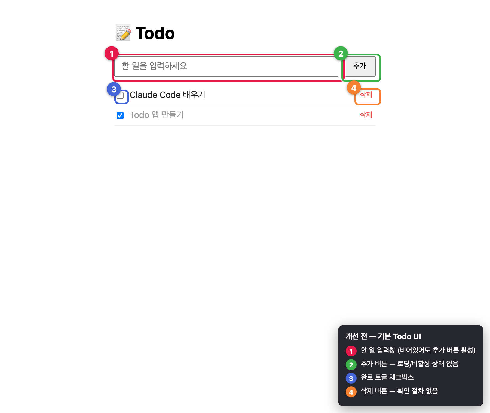
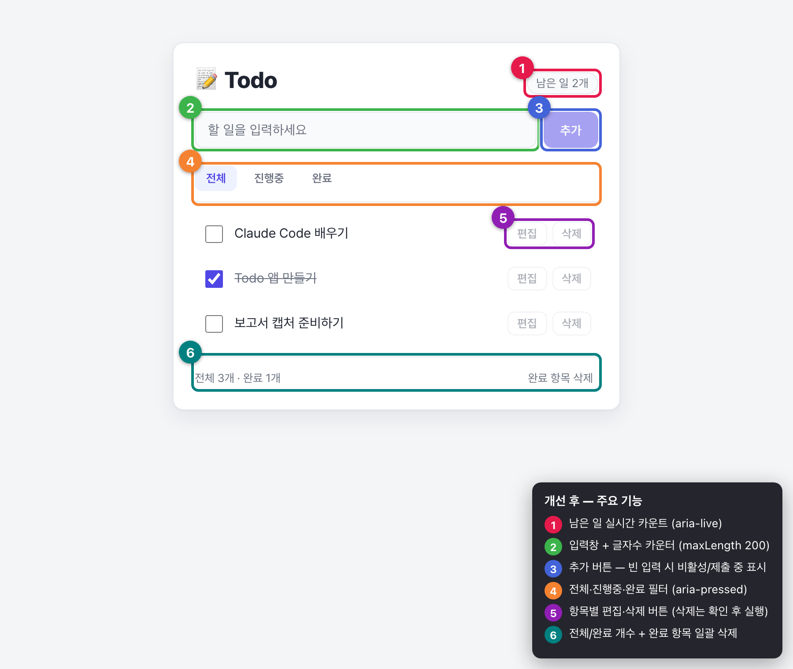
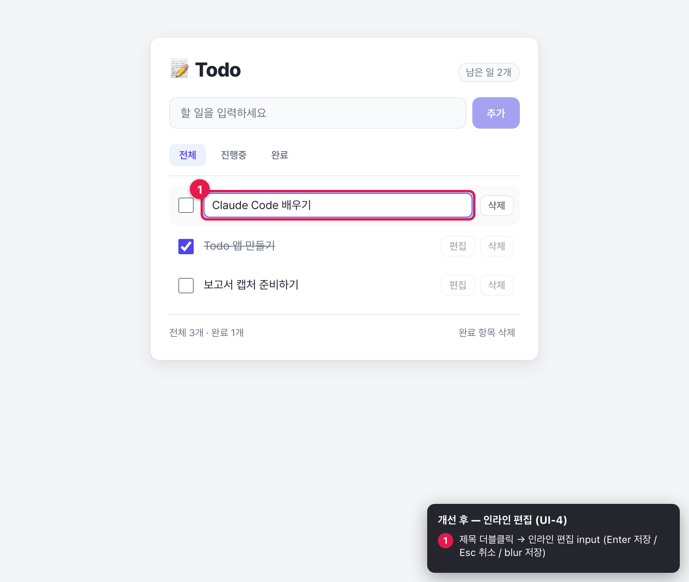
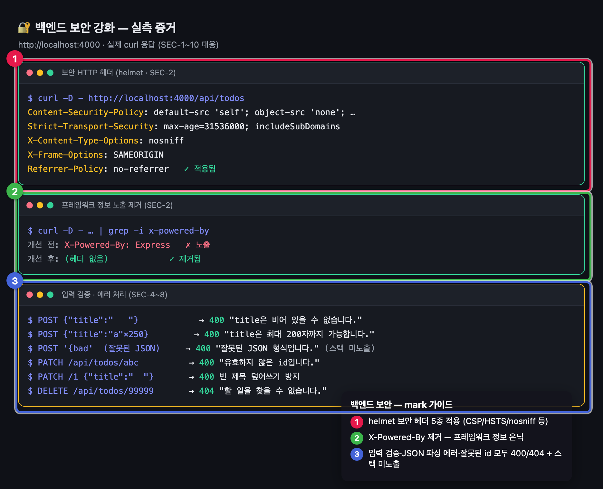

# Todo 앱 보안·UI 개선 보고서

> **대상**: `todo-monorepo` (React + TypeScript 프론트엔드 / Express 백엔드)
> **작성일**: 2026-06-09
> **방식**: 다중 에이전트 오케스트레이션(Workflow) — 병렬 분석 → 구현 → 단계별 독립 에이전트 검증(빌드·백엔드·화면)
> **결과**: 보안 취약점 **10건**, UI/UX 미흡 **18건** 식별 및 개선 · 1·2차 검증 **전 항목 통과** ✅

---

## 1. 요약 (Executive Summary)

| 영역 | 식별 | 개선 | 검증 |
|------|------|------|------|
| 백엔드 보안 | 10건 (high 4 · medium 3 · low 3) | 완료 | 1차: 빌드 + 보안 동작 9/9 통과 |
| 프론트 UI/UX | 18건 (high 4 · medium 9 · low 5) | 완료 | 2차: 빌드 + 화면 15/15 통과 |

전 과정을 **별도 에이전트**가 교차 검증했습니다.

- **1차 검증** (백엔드 강화 후): `build-verify` 에이전트가 빌드/구문을, `backend-verify` 에이전트가 실제 curl로 보안 동작 9종을 검증 → **전부 통과**
- **2차 검증** (프론트 개선 후): `build-verify` 에이전트가 타입/빌드를, `screen-verify` 에이전트가 실제 스크린샷을 육안 검증 → **전부 통과**

---

## 2. 개선 전 화면 (Before)

기존 UI는 인라인 스타일 기반의 최소 구현으로, 로딩·빈 상태·편집·필터·접근성 처리가 없었습니다.

| 번호 | 문제 |
|------|------|
| ① | 입력창 — 비어 있어도 추가 버튼이 활성, `maxLength` 없음 |
| ② | 추가 버튼 — 로딩/비활성 상태 피드백 없음 |
| ③ | 완료 토글 체크박스 — 레이블/`aria-label` 미흡 |
| ④ | 삭제 버튼 — 확인 절차 없이 즉시 삭제, 접근 가능한 이름 모호 |

추가로 빈 상태가 `<ul>` 안에 `
`로 렌더(유효하지 않은 마크업), 에러 메시지가 사라지지 않음, 제목 편집·필터·다크모드 부재 등의 문제가 있었습니다.

---

## 3. 개선 후 화면 (After)

| 번호 | 개선 기능 | 대응 |
|------|-----------|------|
| ① | **남은 일 실시간 카운트** 배지 (`aria-live`) | UI-5, UI-12 |
| ② | **입력창 + 글자수 카운터** (`maxLength=200`, trim) | UI-8, UI-9 |
| ③ | **추가 버튼** — 빈 입력 시 비활성 / 제출 중 "추가 중…" | UI-7 |
| ④ | **전체·진행중·완료 필터** (`aria-pressed`) | UI-5 |
| ⑤ | **항목별 편집·삭제 버튼** — 삭제는 `confirm` 후 실행 | UI-4, UI-6, UI-11 |
| ⑥ | **전체/완료 개수 + 완료 항목 일괄 삭제** | UI-5 |

### 3.1 인라인 편집 (UI-4)

제목을 **더블클릭**하면 인라인 편집 input으로 전환됩니다. `Enter` 저장 / `Esc` 취소 / `blur` 저장의 표준 패턴을 구현했습니다.

### 3.2 그 외 적용된 개선

- **로딩 스켈레톤**(UI-1): 초기 로드 중 shimmer 스켈레톤 3행 + `aria-live` 안내 → 데이터 도착 전 잘못된 "할 일 없음" 표시 제거
- **빈 상태 분리**(UI-2): `<ul>` 외부 `
`로 분기, 필터별 안내 문구 차별화
- **에러 알림 개선**(UI-3, UI-12): `role="alert"` + 닫기(×) 버튼 + 각 작업 시작 시 자동 초기화
- **낙관적 업데이트**(UI-17): 토글/삭제 즉시 반영 후 실패 시 롤백, 응답 런타임 타입 검증(`assertTodo`)
- **디자인 시스템화**(UI-13): 인라인 스타일 → `styles.css` CSS 변수 기반
- **포커스 가시성**(UI-14): 전 인터랙티브 요소에 `:focus-visible` 링
- **다크모드**(UI-15): `prefers-color-scheme` 대응
- **반응형**(UI-16): 480px 이하 레이아웃 최적화

---

## 4. 백엔드 보안 강화 (Before → After)

실제 `curl` 응답으로 검증한 증거입니다.

| 번호 | 강화 내용 | 대응 |
|------|-----------|------|
| ① | **helmet 보안 헤더 5종** — CSP / HSTS / nosniff / X-Frame-Options / Referrer-Policy | SEC-2 |
| ② | **X-Powered-By 제거** — Express 프레임워크 정보 은닉 | SEC-2 |
| ③ | **입력 검증·에러 처리** — 빈/초과 title, 잘못된 JSON, 비숫자 id 모두 400/404 + 스택 미노출 | SEC-4·6·7·8 |

### 4.1 전체 보안 조치

| ID | 취약점 | 조치 |
|----|--------|------|
| SEC-1 | CORS 전역 허용 | `ALLOWED_ORIGINS` 화이트리스트 기반 origin 검증 |
| SEC-2 | 보안 헤더 부재 | `helmet()` 적용 + `x-powered-by` 비활성화 |
| SEC-3 | Rate Limit 부재 | 전역 500/15분, 쓰기(POST/PATCH/DELETE) 100/15분 |
| SEC-4 | 입력 길이/타입 검증 부재 | `validateTitle()` — 문자열·trim·최대 200자 |
| SEC-5 | body 크기 제한 부재 | `express.json({ limit: "10kb" })` |
| SEC-6 | 에러 핸들링 부재 | 404 핸들러 + 전역 에러 미들웨어(스택 은닉) + `unhandledRejection`/`uncaughtException` |
| SEC-7 | PATCH 빈 제목 허용 | PATCH에도 title 검증 적용 |
| SEC-8 | id 경계 검증 부재 | `parseId()` — 양의 정수만 허용, 그 외 400 |
| SEC-9 | 클라이언트 검증 부재 | `api.ts`에 보조 trim/길이 검증 + 서버 에러 메시지 활용 |
| SEC-10 | 운영 보안 미흡 | `trust proxy` 설정 (프록시 뒤 실 IP 인식 / HSTS) |

---

## 5. 단계별 에이전트 검증 결과

### 5.1 1차 검증 — 빌드 + 백엔드 보안 동작 (별도 에이전트 병렬)

| 검증 에이전트 | 항목 | 결과 |
|----------------|------|------|
| `build-verify` | `npm run build`(tsc+vite), `node --check` | ✅ 종료코드 0 |
| `backend-verify` | GET 200 / 보안헤더 / 빈·초과 title 400 / 잘못된 JSON 400 / 비숫자 id 400 / PATCH 빈 title 400 / 없는 id 404 / 정상 토글 200 (9종) | ✅ 9/9 통과 |

### 5.2 2차 검증 — 빌드 + 화면 (별도 에이전트 병렬)

| 검증 에이전트 | 항목 | 결과 |
|----------------|------|------|
| `build-verify` | 타입 에러 0, CSS 산출물 생성 | ✅ 통과 |
| `screen-verify` | 실제 스크린샷 육안: 카드 디자인·카운트 배지·필터·편집/삭제·푸터·완료 필터 동작·인라인 편집 + 접근성 속성(role/aria/maxLength/disabled/skeleton/빈상태 분리) 15종 | ✅ 15/15 통과 |

---

## 6. 변경 파일

| 파일 | 변경 |
|------|------|
| `packages/backend/src/index.js` | 보안 강화 전면 재작성 (SEC-1~10) |
| `packages/backend/package.json` | `helmet`, `express-rate-limit` 추가 |
| `packages/frontend/src/App.tsx` | UX 전면 개선 (UI-1~18) |
| `packages/frontend/src/api.ts` | 클라이언트 검증·에러 메시지·응답 타입 검증 |
| `packages/frontend/src/styles.css` | 신규 — 디자인 시스템(CSS 변수·다크모드·반응형·포커스 링) |

---

## 7. 후속 권장 사항

- **인메모리 저장소**는 테스트용이므로, 운영 시 영속 저장소(DB) + 트랜잭션 도입 필요
- **인증/인가** 추가 시 CORS `credentials`와 origin을 정확히 짝짓고 CSRF 토큰 도입
- 운영 배포 시 **리버스 프록시(nginx)에서 TLS 종료** + `client_max_body_size` 추가 제한
- 자동화 테스트(단위·E2E) 추가로 회귀 방지

---

*본 보고서의 모든 캡처는 실행 중인 앱(`localhost:5174` / `localhost:4000`)을 Playwright로 실제 캡처하고, 번호 배지·강조 박스·범례를 오버레이하여 생성했습니다.*
